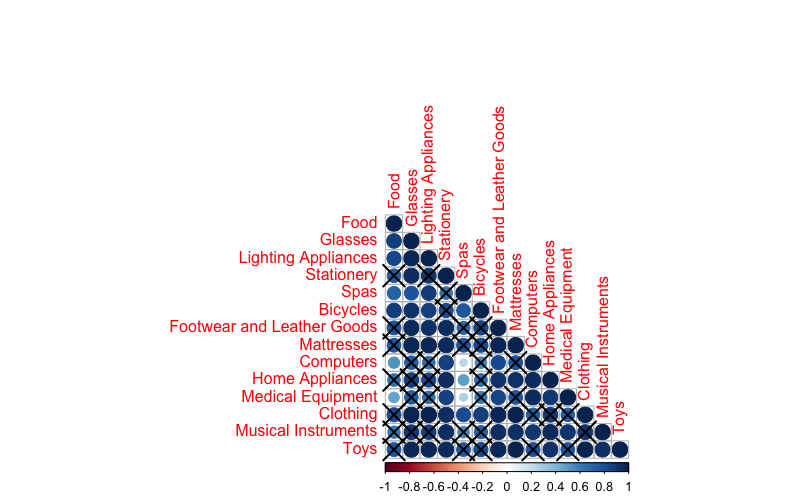

# Ahora 12: Credit Card Financing and Consumer Behavior Analysis
This project applies Principal Component Analysis (PCA) to the Ahora 12 program dataset to uncover regional spending patterns and identify key consumer behavior trends across Argentina.

# **Project Overview**

---

### **Objective**

The objective of this project is to perform a **Principal Component Analysis (PCA)** on the **Ahora 12** program dataset, analyzing product category consumption across different provinces in Argentina. The goal is to identify key consumption patterns and relationships between product categories and regions.

### **Context**

**Ahora 12** is a government initiative that allows consumers to purchase **national products in fixed installments** using credit cards. The program, valid until June 30, 2022, is structured through a financial agreement involving retailers, credit card companies, banks, and the government.

The **Ministry of Economy** establishes the legal framework, while the **Central Bank of Argentina (BCRA)** defines the banking policies. The program benefits:

- **Consumers**, who can finance purchases over 12 months at zero interest.
- **Retailers**, who pay a **reduced financing fee of 10%** instead of the usual 26%.
- **Banks**, which absorb the interest difference but receive a **16% reduction in reserve requirements**, freeing up capital for lending.

By conducting this **PCA study**, we aim to uncover patterns in **consumer spending behavior** within the Ahora 12 framework, providing insights into regional trends and high-impact product categories.

### **Duration**

The analysis was conducted over several weeks, following a structured process of **data preprocessing, exploratory analysis, PCA modeling, and interpretation**.

### **Role**

As the **data analyst** for this project, I led the extraction and cleaning of the dataset, performed statistical analysis, and applied **Principal Component Analysis (PCA)** to derive insights.

### **Tools and Methodologies**

- **Software:** R (for statistical computing and visualization)
- **Techniques:** PCA, correlation matrix, Bartlett’s test, Scree plot, Biplot visualization

---

# **The Approach and Process**

### **Data Preprocessing**

The dataset was extracted from [Argentina's open data portal](https://datos.gob.ar/dataset/produccion-programa-ahora-12), containing information on **product categories and provinces** participating in the **Ahora 12** program. The variables include:

| Variable | Data Type |
| --- | --- |
| Province | Categorical |
| Food | Numeric |
| Glasses | Numeric |
| Lighting Appliances | Numeric |
| Stationery | Numeric |
| Spas | Numeric |
| Bicycles | Numeric |
| Footwear and Leather Goods | Numeric |
| Mattresses | Numeric |
| Computers | Numeric |
| Home Appliances | Numeric |
| Medical Equipment | Numeric |
| Clothing | Numeric |
| Musical Instruments | Numeric |
| Toys | Numeric |
| Books | Numeric |
| Machinery and Tools | Numeric |
| Construction Materials | Numeric |
| Medications | Numeric |
| Motorcycles | Numeric |
| Furniture | Numeric |
| Tires | Numeric |
| Perfumes | Numeric |
| Personal Care Services | Numeric |
| Alarm Installation Services | Numeric |
| Event Organization Services | Numeric |
| Sports Services | Numeric |
| Educational Services | Numeric |
| Technical Services | Numeric |
| Repair Workshops | Numeric |
| Tourism | Numeric |

---

### **Exploratory Data Analysis (EDA)**

To ensure the **feasibility of PCA**, an exploratory analysis was conducted:

- **Correlation Matrix:** Verified the relationships between product categories.



**Explanation:**

This correlation matrix visually represents the relationships between different product categories. The darker and larger circles indicate a stronger correlation, while the lighter and smaller circles represent weaker relationships. This step ensures that the dataset meets the PCA assumptions by verifying whether strong correlations exist between variables.

- **Bartlett’s Sphericity Test:** Ensured the dataset was suitable for PCA by testing whether the correlation matrix was an identity matrix. The result showed a **p-value of 0**, confirming PCA applicability.
- **Standardization:** Data was **centered and scaled** to ensure comparability across variables.


**Explanation:**

This **PCA variable correlation plot** shows how the product categories relate to the principal components. The arrows represent the strength and direction of the correlation between variables and the components. Variables that are grouped together indicate similar purchasing behavior patterns.

---

### **Principal Component Analysis (PCA) Application**

To determine the **number of principal components**, we used:

1. **Eigenvalue Criterion (Kaiser’s rule):** Components with eigenvalues **greater than 1** were retained. This resulted in **three principal components** explaining **95% of the variance**.
2. **Scree Plot:** Visualized the **point of inflection** to confirm the number of extracted components.


**Explanation:**

The **Scree Plot** helps determine the number of principal components to retain. The steep decline between the first and second component indicates that most of the variance is explained by the first component (78%), with the second (12.1%) adding further explanation. The remaining components contribute little additional variance.

### **PCA Interpretation**

1. **First Principal Component (PC1):** Strong **negative** associations with **Glasses, Footwear, Mattresses, Clothing, Toys, Medications, Motorcycles, and Perfumes**. This component represents **spending on goods**.
2. **Second Principal Component (PC2):** Strong **positive** associations with **Computers, Medical Equipment, Musical Instruments, Technical Services, Sports Services, and Tourism**. This component reflects **spending on services**.
3. **Third Principal Component (PC3):** Strong **positive** associations with **Alarm Installation Services**, representing **security-related spending**.


**Explanation:**

This plot visualizes the **factor coordinates of product categories**. It helps identify which categories are highly correlated with each principal component. For example, variables positioned far from the origin have a strong influence on the first two components.


**Explanation:**

This **individual PCA representation plot** shows the distribution of provinces based on their scores in the first two principal components. Provinces that are far apart exhibit different purchasing behaviors, while those closer together have similar spending patterns.


**Explanation:**

This **PCA Biplot** combines the representation of product categories and provinces. It helps to identify how different provinces align with various product categories. For example, **Buenos Aires and Santa Fe** are positioned where high consumer spending on goods and services is dominant.

```r
# PCA Biplot Visualization
fviz_pca_biplot(fit,
                geom.ind = "point",
                fill.ind = AHORA12$Provincia, col.ind = "black",
                pointshape = 21, pointsize = 2,
                palette = "jco",
                addEllipses = TRUE,
                alpha.var = "contrib", col.var = "contrib",
                gradient.cols = "RdYlBu",
                legend.title = list(fill = "Province", color = "Contrib",
                                    alpha = "Contrib"))

```


**Explanation:**

This **color-coded PCA Biplot** enhances the previous visualization by adding a color scheme based on provincial clustering. It provides an easier interpretation of regional consumption differences and highlights how each province aligns with the principal components.

---

# **End Results and Recommendations**

### **Key Findings**


- The **highest spending categories** were **Clothing, Construction Materials, and Tires**.
- Among services, the **highest spending was in Tourism, Sports Services, and Perfumes**.
- **Buenos Aires and Santa Fe** showed a strong correlation between **goods and services spending**, indicating a balanced purchasing pattern.
- **Córdoba and Buenos Aires City** had **high goods spending but lower service expenditures**.

### **Strategic Recommendations**

1. **Customized Financial Strategies:**
    - Adapt **interest-free installment plans** based on product category demand in each province.
2. **Targeted Marketing Campaigns:**
    - Promote **high-impact categories** in regions with strong spending patterns.
3. **Regional Spending Analysis:**
    - Tailor retail strategies to fit **province-specific consumption trends**.
4. **Enhancing Program Impact:**
    - Expand product offerings based on **high-demand categories** identified through PCA.

---

# **Strategic Insights and Program Optimization Recommendations**

Based on the **Principal Component Analysis (PCA)** of the **Ahora 12** program, the following recommendations aim to **enhance the program’s efficiency, optimize consumer engagement, and tailor financial strategies** to regional spending behaviors.

---

### **1. Optimize Payment Plan Structures**

- Adjust installment plans based on product category demand in each province.
- Offer **extended financing options** for high-investment goods such as **home appliances, construction materials, and furniture**, which showed **high expenditure levels** in the PCA.
- Implement **shorter installment plans** (e.g., 3-6 months) for low-cost items like **books, toys, and stationery**, where faster repayment may encourage repeat purchases.

---

### **2. Targeted Promotion of High-Impact Categories**

- Focus marketing efforts on **top-selling categories**:
    - **Clothing, construction materials, and tires** for goods.
    - **Tourism, sports services, and personal care services** for services.
- Encourage businesses to promote their products within **Ahora 12** using targeted messaging about **zero-interest financing benefits**.

---

### **3. Regional Customization of Offers**

- **Buenos Aires and Santa Fe:** Develop strategies that integrate **goods and services**, as PCA results show a strong correlation between spending on both.
- **Córdoba and Buenos Aires City (CABA):** Encourage service consumption, as spending in this sector is comparatively lower.
- **Northern provinces (e.g., Jujuy, Formosa):** Support businesses with **localized incentives** to increase Ahora 12 participation.

---

### **4. Optimizing Retailer Participation**

- Introduce **higher merchant incentives** for underperforming categories and regions.
- Improve awareness among retailers regarding the **benefits of Ahora 12**, particularly in industries with lower participation (e.g., **educational and repair services**).
- Develop a **digital tool** to help merchants understand how Ahora 12 impacts their sales, using **data-driven insights**.

---

### **5. Enhancing Customer Engagement & Trust**

- **Loyalty & Reward Programs:**
    - Implement cashback or discounts on future purchases for customers who frequently use **Ahora 12** for payments.
- **Awareness Campaigns:**
    - Increase communication efforts regarding the program’s benefits, especially in **low-adoption regions**.
- **User Experience Optimization:**
    - Encourage banks and credit card companies to **simplify the installment payment process** for consumers.

---

### **6. Expanding the Range of Eligible Products & Services**

- Evaluate the inclusion of **emerging service industries** that may benefit from installment payments, such as **digital subscriptions or tech services**.
- Enhance the **visibility of service-based sectors**, particularly **technical services, event organization, and educational services**, which have lower representation in Ahora 12 spending.

---

### **7. Data-Driven Program Adjustments**

- **Quarterly Data Reviews:** Regularly assess spending patterns across categories and provinces to adjust financing conditions.
- **Predictive Analysis Implementation:** Use machine learning models to anticipate category growth and optimize financing terms accordingly.
- **A/B Testing for Policy Adjustments:** Experiment with different financing conditions (e.g., 18-month vs. 12-month plans) in select provinces to assess the impact on participation and spending.

---

# **Conclusion**

This **Principal Component Analysis** provided valuable insights into the **spending patterns** within the **Ahora 12** program. The findings can help policymakers and retailers optimize **financial strategies, marketing efforts, and product availability** to maximize the program’s effectiveness across Argentina.

### **Next Steps**

- Further integration with **macroeconomic indicators** to understand external influences on spending.
- Application of **cluster analysis** to refine consumer segmentation.
- Development of **predictive models** to forecast category demand.

---
